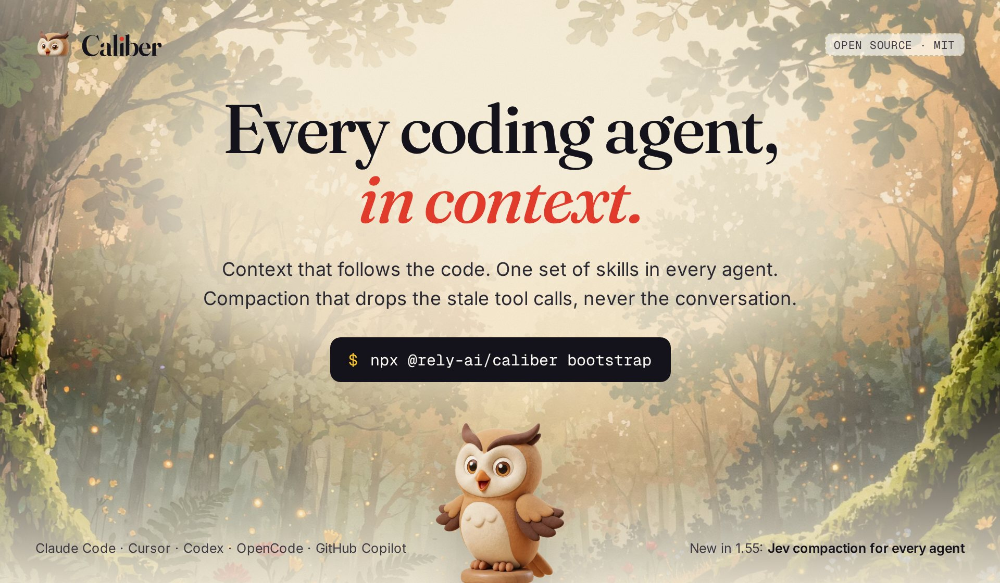
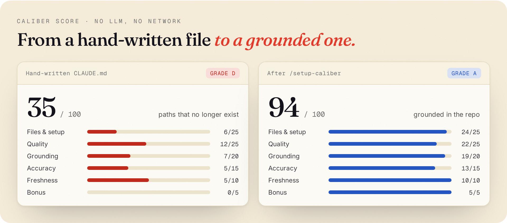
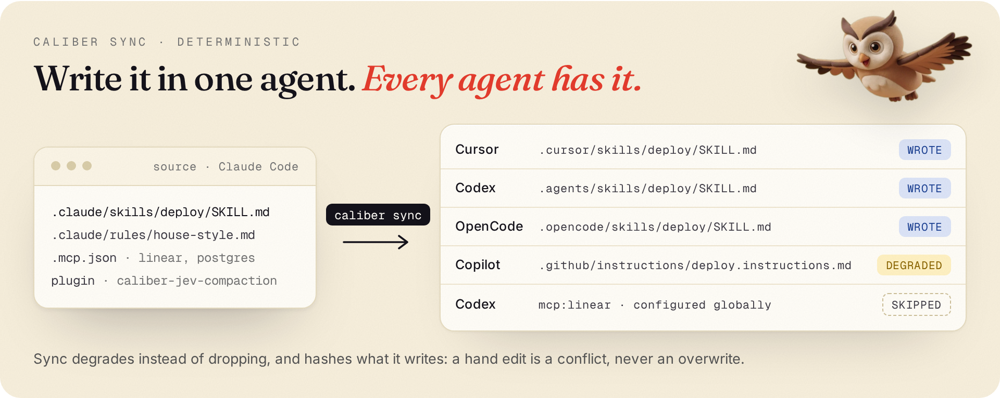

<p align="center">
  
</p>

<p align="center">
  <a href="https://www.npmjs.com/package/@rely-ai/caliber"></a>
  <a href="./LICENSE"></a>
  <a href="https://nodejs.org"></a>
  
  <a href="https://discord.gg/u3dBECnHYs"></a>
</p>

<p align="center">
  <b>Claude Code</b> · <b>Cursor</b> · <b>Codex</b> · <b>OpenCode</b> · <b>GitHub Copilot</b>
</p>

# Caliber

**The open-source context layer for coding agents.**

Your agents are only as good as what they know about the repo, and what they know rots. The `CLAUDE.md` you wrote last month points at files you have since renamed. The skill you wrote in Claude Code does not exist in Cursor. The session that ran for three hours gets summarized into a paragraph that forgot the error message.

Caliber fixes all three, locally, with your own seat or key:

- **Fresh.** Writes the files every agent reads, then refreshes them from your diff on every commit.
- **Shared.** Write a skill, rule or MCP server once. `caliber sync` gives every agent the same one, with no LLM involved.
- **Lean.** *New in 1.54 and 1.55:* Jev compaction scores each tool call and drops the stale ones. Every word you and the agent wrote stays verbatim. Claude Code gets it as a plugin; Cursor, Codex and any other agent get it from the CLI.

<p align="center">
  
</p>

## Start

One command, then let your agent do the rest. Requires **Node.js 20+**.

```bash
npx @rely-ai/caliber bootstrap
```

Then start Claude Code or the Cursor CLI in your terminal (not the IDE chat) and type:

```
/setup-caliber
```

Your agent reads the stack, writes `CLAUDE.md`, Cursor rules, `AGENTS.md` and Copilot instructions, shows you the diff, and installs the hooks that keep them current.

No Claude Code or Cursor? `caliber init` is the same setup as a CLI wizard, on your Anthropic, OpenAI, MiniMax or Vertex key.

> **Your code stays on your machine.** Bootstrap and scoring are local: no LLM calls, nothing uploaded. Generation runs on your seat or your key. Caliber never sees your source.

<details>
<summary><strong>Windows</strong></summary>

- **Run from a terminal** (PowerShell, CMD or Git Bash), not from an IDE chat. `cd` into the project, then `npx @rely-ai/caliber bootstrap`.
- **Git Bash is recommended.** Pre-commit hooks and auto-sync scripts use shell syntax. PowerShell-only setups may skip hooks silently.
- **Cursor Agent CLI:** if prompted to install it, download it from [cursor.com/downloads](https://www.cursor.com/downloads) instead of the macOS/Linux `curl | bash`. Then `agent login`.
- **One terminal at a time.** Two Caliber processes in one repo will fight over provider detection.

</details>

## 01 · Fresh: context that follows the code

<p align="center">
  
</p>

Hand-written agent files go stale the moment you refactor. Caliber grounds them in the repo it actually finds (real paths, real commands, real architecture) and then keeps them there: a pre-commit hook reads your diff and rewrites only what changed.

`caliber score` is how you know. It is filesystem math, not an opinion: no LLM, no network. It checks that every path the config mentions exists, that commands and code blocks are present, and that the config has not drifted from git history.

```bash
caliber score                   # audit the current setup
caliber score --compare main    # how this branch moved the score
```

```
  npx @rely-ai/caliber bootstrap       ← once, about 2 seconds
              │
              ▼
   agent runs /setup-caliber           ← detects, writes, shows the diff
              │
              ▼
  ┌──── configs written ◄──────────────┐
  │           │                        │
  │           ▼                        │
  │     your code moves                │
  │     (new deps, renamed files,      │
  │      a new service)                │
  │           │                        │
  │           ▼                        │
  └──► caliber refresh ──────────────►─┘
       (on every commit)
```

New teammates are nudged to run bootstrap on their first session, so the whole team stays on the same context without anyone coordinating it.

<details>
<summary><strong>What Caliber writes, per agent</strong></summary>

**Claude Code**
- `CLAUDE.md`: project context, build and test commands, architecture, conventions
- `CALIBER_LEARNINGS.md`: patterns learned from your coding sessions
- `.claude/skills/*/SKILL.md`: reusable skills ([OpenSkills](https://agentskills.io) format)
- `.mcp.json`: discovered MCP server configurations
- `.claude/settings.json`: permissions and hooks

**Cursor**
- `.cursor/rules/*.mdc`: rules with frontmatter (description, globs, alwaysApply)
- `.cursor/skills/*/SKILL.md`: skills
- `.cursor/mcp.json`: MCP server configurations

**OpenAI Codex**
- `AGENTS.md`: project context
- `.agents/skills/*/SKILL.md`: skills

**OpenCode**
- `AGENTS.md`: project context (shared with Codex when both are targeted)
- `.opencode/skills/*/SKILL.md`: skills

**GitHub Copilot**
- `.github/copilot-instructions.md`: project context
- `.github/instructions/*.instructions.md`: skills and rules, degraded into scoped instruction files

</details>

<details>
<summary><strong>How the score is built</strong></summary>

| Category | Points | What it checks |
|---|---|---|
| **Files & setup** | 25 | Config files exist, skills present, MCP servers, cross-platform parity |
| **Quality** | 25 | Code blocks, a lean token budget, concrete instructions, structured headings |
| **Grounding** | 20 | The config references real project directories and files |
| **Accuracy** | 15 | Referenced paths exist on disk, config freshness against git history |
| **Freshness & safety** | 10 | Recently updated, no leaked secrets, permissions configured |
| **Bonus** | 5 | Auto-refresh hooks, `AGENTS.md`, OpenSkills format |

Every failing check carries structured fix data, so when `caliber init` regenerates, the model is told exactly what is wrong and how to fix it. If your config already scores **95+**, Caliber skips regeneration and patches only the failing checks.

</details>

<details>
<summary><strong>Refresh hooks and auto-staging</strong></summary>

| Hook | Trigger | What it does |
|---|---|---|
| **Git pre-commit** | Before each commit | Refreshes docs from the diff and stages them |
| **Claude Code session end** | End of each session | Runs `caliber refresh` |
| **Learning hooks** | During each session | Captures events for session learning |

```bash
caliber hooks --install    # enable refresh hooks
caliber hooks --remove     # disable them
```

`caliber refresh` reads committed, staged and unstaged changes and updates only the sections they touch. If you would rather review refreshed docs before they land (signed commits, minimal diffs), turn off auto-staging. The refresh still runs; the files stay in your working tree:

```bash
git config caliber.autostage false
```

</details>

## 02 · Shared: write a skill once, every agent has it

<p align="center">
  
</p>

Most teams run more than one agent. Caliber keeps them holding the same skills, rules, plugins and MCP servers. `caliber sync` is deterministic (no LLM, no network), so it is cheap enough to run at the start of every session.

```bash
caliber sync                    # mirror into every detected agent
caliber sync --status           # what each agent holds right now
caliber sync --dry-run          # preview, write nothing
caliber sync --from cursor      # choose the source of truth
```

- **It degrades instead of dropping.** Providers are not symmetric. Copilot has no skills directory, so a skill becomes `.github/instructions/*.instructions.md` with `applyTo` taken from the skill's `paths`. Codex has no plugin system, so a plugin expands into its skills. Anything that cannot be represented is reported with a reason.
- **It never clobbers your edits.** Sync hashes every file it writes. A file you edited by hand is a conflict until you pass `--force`.
- **It stays in its lane.** `refresh` owns the prose documents. `sync` owns the artifacts.

<details>
<summary><strong>A sync run, and the hooks that make it continuous</strong></summary>

```
Caliber Sync

  Source: Claude Code — 4 item(s)
  Targets: Cursor, Codex, GitHub Copilot

  wrote  .cursor/skills/deploy/SKILL.md
  wrote  .cursor/rules/house-style.mdc
  wrote  .cursor/mcp.json
  wrote  .agents/skills/deploy/SKILL.md
  wrote  .github/instructions/deploy.instructions.md
  skipped  mcp:linear for codex — Codex MCP servers are configured globally
```

Two optional hooks (`caliber hooks`) keep it running without you:

| Hook | Effect |
|---|---|
| `Agent sync (SessionStart)` | Every agent starts the session holding the same skills and rules |
| `Agent sync (on edit)` | Editing a skill in one agent mirrors it immediately |

The on-edit hook is path-filtered to provider skill and rule directories, so ordinary edits cost nothing.

</details>

## 03 · Lean: compact without summarizing

<p align="center">
  
</p>

Long sessions end in `/compact`, and `/compact` is a summary. Summaries forget the exact things you needed: the file path, the error string, the constraint you gave an hour ago.

[TypeSafe's](https://typesafe.ai) **Jev** model takes a different approach. It scores every tool call and tool result for whether the session still needs it, drops what went stale, and leaves everything else **byte-for-byte verbatim**. Nothing is rewritten, so nothing is misremembered.

**In Claude Code**, it replaces `/compact` in-session as a plugin:

```bash
export CLAUDE_CODE_ENABLE_FUNCTION_HOOKS=1   # function hooks are early access, off by default
export AI_GATEWAY_API_KEY=...                # a Vercel AI Gateway key
# or: export TYPESAFE_API_KEY=...            # a TypeSafe System One key

claude plugin marketplace add caliber-ai-org/ai-setup
claude plugin install caliber-jev-compaction@caliber
```

Or vendor it into a repo Caliber already manages:

```bash
caliber plugin install --dry-run   # print the file tree, write nothing
caliber plugin install             # .claude/plugins/ plus a local marketplace
caliber plugin list
```

**Everywhere else**, the same scoring runs from the CLI, and `caliber sync` gives every agent a `jev-compaction` skill that tells it how to use it:

```bash
caliber compact                                          # Claude Code: auto-discovers the session, read-only report
caliber compact --provider cursor --transcript <jsonl>   # Cursor agent transcripts
caliber compact --provider generic --transcript ./session.json --write   # Codex, Grok Bot, anything else
```

```
Jev Compaction

  Messages:  248 -> 201
  Chars:     412,880 -> 190,344  (53.9% smaller)
  Calls:     96 scored — 41 kept, 23 results dropped, 26 calls dropped, 6 pinned
```

Below a 25% reduction, `caliber compact` tells you it is not worth the request. If Jev fails, the key is missing, or the transcript does not fit, the plugin logs a fallback and hands off to Claude Code's built-in compaction: a bad Jev day degrades compaction, it never breaks the session. The five-minute install, key and live check are in [`FUNCTIONAL_CHECKLIST.md`](FUNCTIONAL_CHECKLIST.md).

> **Bring your own key.** `AI_GATEWAY_API_KEY` is a Vercel AI Gateway key; `TYPESAFE_API_KEY` is a TypeSafe key. They authenticate different hosts and are not interchangeable. Caliber does not ship, share or proxy either.

<details>
<summary><strong>Which agent gets what</strong></summary>

Claude Code is the only host with a function-hook surface that can replace `/compact` in-session. Cursor, Codex, Grok Bot and similar hosts get the same Jev scoring through the CLI and the synced skill, and apply the result themselves.

| Host | Replaces `/compact` in-session | CLI | `--write` |
|---|---|---|---|
| Claude Code | Yes, via the `caliber-jev-compaction` plugin | `caliber compact` (auto-discovers `~/.claude/projects/…`) | No: Claude owns the file, the plugin replaces the session |
| Cursor agents | No | `caliber compact --provider cursor --transcript <jsonl>` | No: the on-disk JSONL is unofficial, often has `tool_use` without ids and **no `tool_result`**, so a rewrite would invent fields |
| Codex, Grok Bot, others | No | `caliber compact --provider generic --transcript <path>` | Yes: the documented `caliber.transcript.v1` envelope (or OpenAI-compatible messages JSON) round-trips |

`--provider auto` (the default) detects the format. `--transcript` is required unless the session is a Claude Code auto-discover.

Prefer exporting `caliber.transcript.v1` from the agent's **in-memory** conversation, tool results included. Cursor's `~/.cursor/projects/.../agent-transcripts/` file is a thin log, and Jev cannot drop results that were never written. The synced `jev-compaction` skill tells the agent to export, run the CLI and apply the decisions.

The generic envelope (a bare `Message[]` array, JSONL of messages, or an OpenAI-compatible messages array also work):

```json
{
  "schema": "caliber.transcript.v1",
  "messages": [
    { "role": "user", "text": "Fix the test", "toolUses": [] },
    {
      "role": "assistant",
      "text": "Reading",
      "toolUses": [{ "tool_use_id": "call_1", "tool": "Read", "input": { "path": "a.ts" } }]
    },
    {
      "role": "user",
      "text": "",
      "toolUses": [],
      "toolResults": [{ "tool_use_id": "call_1", "text": "file contents" }]
    }
  ]
}
```

</details>

<details>
<summary><strong>Keys, plugin config and testing against the real API</strong></summary>

| Key | Host | Model |
|---|---|---|
| `AI_GATEWAY_API_KEY` | Vercel AI Gateway (`/v4/ai/evaluation-model`) | `typesafe-ai/jev` |
| `TYPESAFE_API_KEY` | TypeSafe System One (`api.typesafe.ai/v1/systemone`) | `jev-latest` |

Set one in the environment, or enter it when `claude plugin install` prompts for `gatewayApiKey` / `apiKey`.

| Hook | What it does |
|---|---|
| `session.compact` | Substitutes the verbatim-trimmed transcript for Claude Code's summary |
| `turn.complete` | Requests compaction once context passes `compactAtPercent` (60% by default) |

The plugin falls back to built-in compaction when the reduction is below `minReductionRatio` or the transcript will not fit the state budget. Configuration is plugin `userConfig` (`apiKey`, `gatewayApiKey`, `gatewayBaseUrl`, `keepThreshold`, `preserveRecentMessages`, `compactAtPercent`, `minReductionRatio`, `maxStateTokens`, `maxRequestTokens`, `truncateHeadChars`, `model`), editable from Claude Code rather than a Caliber config file.

> **Function hooks are an early-access Claude Code surface** and stay off unless `CLAUDE_CODE_ENABLE_FUNCTION_HOOKS=1` is set. `caliber plugin install` prints the enable steps. Authored against Claude Code 2.1.274; revisit after an upgrade.

The unit suite stubs the network. To hit the **real** Jev API:

```bash
# Direct TypeSafe System One (a TypeSafe key, not a Vercel key)
TYPESAFE_API_KEY=sk-... npm run e2e:jev

# Vercel AI Gateway. A Gateway key 401s against api.typesafe.ai,
# so never put it in TYPESAFE_API_KEY.
AI_GATEWAY_API_KEY=... npm run e2e:jev:gateway
```

`e2e:jev:gateway` skips when the key is unset (no fake pass). HTTP 403 `"AI Gateway requires a valid credit card on file"` is **Vercel billing**, not a Caliber bug. Neither test uses a Caliber-hosted or shared secret.

The scoring library is vendored under `src/vendor/` (MIT), so there is nothing extra to install.

</details>

## Safe by default

Caliber treats your existing configs the way a reviewer treats a PR: it proposes, you decide.

1. **Score.** A read-only audit of what you have.
2. **Propose.** Generated or improved configs, shown as a diff.
3. **Review.** Accept, refine in plain language, or decline each change.
4. **Back up.** Originals go to `.caliber/backups/` before every write.
5. **Undo.** `caliber undo` restores everything.

A regeneration that scores lower than what it replaces is reverted automatically. `--dry-run` previews any write, and `caliber uninstall` removes everything Caliber added (hooks, generated sections, skills, learnings) while keeping your own content.

## More that comes with it

<details>
<summary><strong>Any codebase, any agent</strong></summary>

TypeScript, Python, Go, Rust, Java, Ruby, Terraform and more. Language and framework detection is LLM-driven, with no hardcoded mappings.

`caliber bootstrap` detects which agents you have installed. To choose explicitly:

```bash
caliber init --agent claude           # Claude Code only
caliber init --agent cursor           # Cursor only
caliber init --agent codex            # Codex only
caliber init --agent opencode         # OpenCode only
caliber init --agent github-copilot   # GitHub Copilot only
caliber init --agent all              # every platform
caliber init --agent claude,cursor    # comma-separated
```

</details>

<details>
<summary><strong>Session learning</strong></summary>

Caliber watches your coding sessions and learns from them. Hooks capture tool usage, failures and your corrections, and a model distills them into `CALIBER_LEARNINGS.md`, which every agent then reads.

```bash
caliber learn install      # install hooks for Claude Code and Cursor
caliber learn status       # hook status, event count, ROI summary
caliber learn finalize     # run the analysis now (it also runs on session end)
caliber learn remove       # remove the hooks
```

Learnings are typed (**[correction]**, **[gotcha]**, **[fix]**, **[pattern]**, **[env]**, **[convention]**) and deduplicated. The file is capped at `CALIBER_MAX_LEARNINGS` bullets (30 by default); evicted entries go to `.caliber/learnings-archive.md`.

</details>

<details>
<summary><strong>MCP discovery and community skills</strong></summary>

Caliber detects the tools your project depends on (databases, APIs, services) and configures matching MCP servers for Claude Code and Cursor, which `caliber sync` then carries to the other agents. `caliber skills` finds and installs community skills that fit your stack.

</details>

## Commands

| Command | What it does |
|---|---|
| `caliber bootstrap` | Install the agent skills. The fastest way in |
| `caliber init` | Full setup wizard: analyze, generate, review, install hooks |
| `caliber score` | Score config quality (deterministic, no LLM) |
| `caliber score --compare <ref>` | Compare the score against a git ref |
| `caliber refresh` | Update configs from recent code changes |
| `caliber regenerate` | Re-analyze and regenerate (aliases: `regen`, `re`) |
| `caliber sync` | Mirror skills, rules, plugins and MCP across every agent (no LLM) |
| `caliber sync --status` | Show what each agent currently holds |
| `caliber compact` | Report what Jev would drop (`--provider auto/claude/cursor/generic`; `--write` for generic only) |
| `caliber plugin install` | Install the bundled Jev compaction plugin into this project |
| `caliber plugin list` | Show bundled plugins and whether they are installed |
| `caliber plugin remove` | Remove a bundled plugin from this project |
| `caliber skills` | Discover and install community skills |
| `caliber learn` | Session learning: hooks, status, analysis |
| `caliber insights` | Agent performance insights and learning impact |
| `caliber hooks` | Manage refresh and sync hooks |
| `caliber config` | Configure the LLM provider, key and model |
| `caliber status` | Show current setup status |
| `caliber undo` | Revert every change Caliber made |
| `caliber uninstall` | Remove everything Caliber added |

## Providers

No API key needed if you already pay for an agent. Caliber runs on your seat:

| Provider | Setup | Default model |
|---|---|---|
| **Claude Code** (your seat) | `caliber config` → Claude Code | Inherited from Claude Code |
| **Cursor** (your seat) | `caliber config` → Cursor | Inherited from Cursor |
| **Anthropic** | `export ANTHROPIC_API_KEY=sk-ant-...` | `claude-sonnet-4-6` |
| **OpenAI** | `export OPENAI_API_KEY=sk-...` | `gpt-5.4-mini` |
| **MiniMax** | `export MINIMAX_API_KEY=...` | `MiniMax-M3` |
| **Vertex AI** | `export VERTEX_PROJECT_ID=my-project` | `claude-sonnet-4-6` |
| **Custom endpoint** | `OPENAI_API_KEY` + `OPENAI_BASE_URL` | `gpt-5.4-mini` |

Override the model for any provider with `export CALIBER_MODEL=<model-name>` or `caliber config`. Light tasks (classification, scoring) run on a faster model automatically; generation and refinement use the default. Configuration lives in `~/.caliber/config.json` with `0600` permissions, and keys are never written to project files.

<details>
<summary>MiniMax regions</summary>

MiniMax accepts OpenAI-compatible and Anthropic-compatible requests in both regions. Set `MINIMAX_BASE_URL` or pick a base URL in `caliber config`:

| Region | OpenAI-compatible base URL | Anthropic-compatible base URL | Documentation |
|---|---|---|---|
| Global | `https://api.minimax.io/v1` | `https://api.minimax.io/anthropic` | [MiniMax platform docs](https://platform.minimax.io/docs) |
| China | `https://api.minimaxi.com/v1` | `https://api.minimaxi.com/anthropic` | [MiniMax platform docs](https://platform.minimaxi.com/docs) |

</details>

<details>
<summary>Vertex AI advanced setup</summary>

```bash
# Custom region
export VERTEX_PROJECT_ID=my-gcp-project
export VERTEX_REGION=europe-west1

# Service account credentials (inline JSON)
export VERTEX_PROJECT_ID=my-gcp-project
export VERTEX_SA_CREDENTIALS='{"type":"service_account",...}'

# Service account credentials (file path)
export VERTEX_PROJECT_ID=my-gcp-project
export GOOGLE_APPLICATION_CREDENTIALS=/path/to/service-account.json
```

</details>

<details>
<summary>Environment variables</summary>

| Variable | Purpose |
|---|---|
| `AI_GATEWAY_API_KEY` | Your Vercel AI Gateway key for Jev compaction (not a TypeSafe key; not provided by Caliber) |
| `TYPESAFE_API_KEY` | Your TypeSafe System One key for Jev compaction (not provided by Caliber) |
| `ANTHROPIC_API_KEY` | Anthropic API key |
| `OPENAI_API_KEY` | OpenAI API key |
| `OPENAI_BASE_URL` | Custom OpenAI-compatible endpoint |
| `MINIMAX_API_KEY` | MiniMax API key |
| `MINIMAX_BASE_URL` | MiniMax OpenAI-compatible or Anthropic-compatible base URL |
| `VERTEX_PROJECT_ID` | GCP project ID for Vertex AI |
| `VERTEX_REGION` | Vertex AI region (default: `us-east5`) |
| `VERTEX_SA_CREDENTIALS` | Service account JSON (inline) |
| `GOOGLE_APPLICATION_CREDENTIALS` | Service account JSON file path |
| `CALIBER_USE_CLAUDE_CLI` | Use the Claude Code CLI (`1` to enable) |
| `CALIBER_USE_CURSOR_SEAT` | Use your Cursor subscription (`1` to enable) |
| `CALIBER_MODEL` | Override the model for any provider |
| `CALIBER_FAST_MODEL` | Override the fast model for any provider |
| `CALIBER_MAX_LEARNINGS` | Cap for `CALIBER_LEARNINGS.md` bullets (default: `30`); evicted entries go to `.caliber/learnings-archive.md` |

</details>

## FAQ

<details>
<summary><strong>Does it overwrite my existing configs?</strong></summary>

No. Every proposed change is shown as a diff that you accept, refine or decline. Originals are backed up first, and `caliber undo` restores them.

</details>

<details>
<summary><strong>Does it need an API key?</strong></summary>

**Bootstrap, scoring and sync:** no. They run entirely on your machine with no LLM.

**Generation and refresh** (`/setup-caliber`, `caliber init`, `caliber refresh`): your existing Claude Code or Cursor seat, or your own Anthropic, OpenAI, MiniMax or Vertex key.

**Jev compaction** (the plugin or `caliber compact`): yes, your own `AI_GATEWAY_API_KEY` (Vercel AI Gateway) or `TYPESAFE_API_KEY` (TypeSafe). Caliber does not provide one.

</details>

<details>
<summary><strong>Does it send my code anywhere?</strong></summary>

Scoring and sync are fully local. Generation sends a project summary (languages, structure, dependencies, not source files) to the provider you configured, the same one your editor already uses. Jev compaction sends the session transcript to the Jev host you chose with your key.

Anonymous usage analytics (command names and durations, never code or file contents) are collected via PostHog. To opt out:

- **Per run:** `caliber --no-traces <command>`
- **Always:** `export CALIBER_TELEMETRY_DISABLED=1`

</details>

<details>
<summary><strong>What is the difference between bootstrap and init?</strong></summary>

`caliber bootstrap` installs the agent skills in about two seconds; your agent then runs `/setup-caliber` from inside the session. `caliber init` is the full interactive wizard for people who prefer the CLI. Both end in the same place.

</details>

<details>
<summary><strong>What if I do not like what it generates?</strong></summary>

Refine it in plain language during review, or decline it. If you already accepted, `caliber undo` restores everything. `--dry-run` previews before anything is written.

</details>

<details>
<summary><strong>Does Jev work if I am not on Claude Code?</strong></summary>

Yes. Claude Code is the only host where it can replace `/compact` automatically, because it is the only one with function hooks. Cursor, Codex, Grok Bot and others get the same scoring from `caliber compact` and the synced `jev-compaction` skill. See [which agent gets what](#03--lean-compact-without-summarizing).

</details>

<details>
<summary><strong>Does it work with monorepos?</strong></summary>

Yes. Run `caliber init` from any directory. `caliber refresh` can update configs across several repos when run from a parent directory.

</details>

## Contributing

See [CONTRIBUTING.md](./CONTRIBUTING.md) for the full guide.

```bash
git clone https://github.com/caliber-ai-org/ai-setup.git
cd ai-setup
npm install
npm run dev      # watch mode
npm run test     # run tests
npm run build    # compile
```

We use [conventional commits](https://www.conventionalcommits.org/): `feat:` for features, `fix:` for bug fixes. The README art is rendered from [`assets/readme/src/art.html`](assets/readme/src/art.html) with `node scripts/render-readme-art.mjs --lp ../caliber-lp`.

## Show your score

After `caliber score`, add a badge to your own README:


```

```

Replace `SCORE` with your number and `COLOR` with `brightgreen` (90+), `green` (70–89), `yellow` (40–69) or `red` (under 40).

<p align="center">
  
</p>

<p align="center">
  <sub>MIT licensed · <a href="https://github.com/caliber-ai-org/ai-setup">caliber-ai-org/ai-setup</a> · <a href="https://www.npmjs.com/package/@rely-ai/caliber">@rely-ai/caliber</a> · <a href="https://discord.gg/u3dBECnHYs">Discord</a></sub>
</p>
