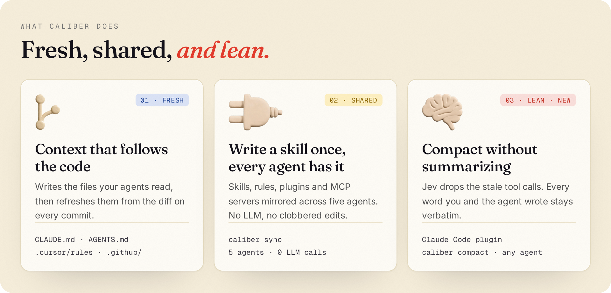
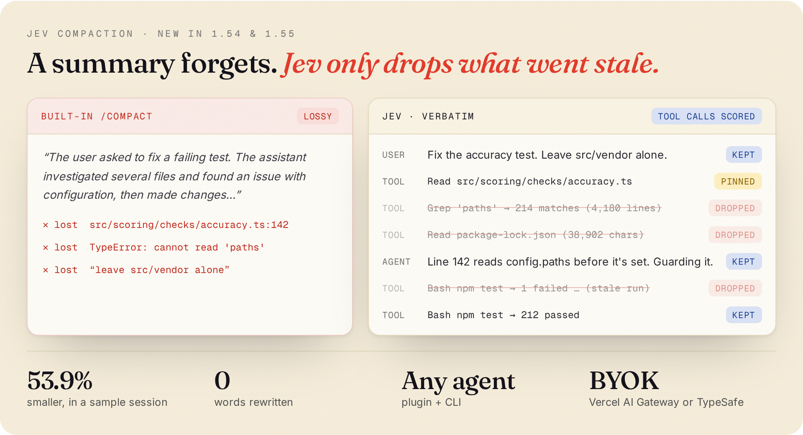

<p align="center">
  <picture>
    <source media="(prefers-color-scheme: dark)" srcset="assets/readme/logo-dark.png">
    
  </picture>
</p>

<p align="center"><b>The open-source context layer for coding agents.</b><br>
Claude Code · Cursor · Codex · OpenCode · GitHub Copilot</p>

<p align="center">
  <a href="https://www.npmjs.com/package/@rely-ai/caliber"></a>
  <a href="./LICENSE"></a>
  <a href="https://nodejs.org"></a>
</p>

<p align="center">
  
</p>

## Start

```bash
npx @rely-ai/caliber bootstrap
```

Then, in Claude Code or the Cursor CLI, run `/setup-caliber`. Your agent writes `CLAUDE.md`, Cursor rules, `AGENTS.md` and Copilot instructions, shows you the diff, and installs the hooks that keep them current. No agent handy? `caliber init` does the same as a wizard.

Node 20+. Runs on your Claude Code or Cursor seat, or your own Anthropic, OpenAI, MiniMax or Vertex key. Bootstrap, scoring and sync run fully local.

## Fresh

A pre-commit hook reads your diff and refreshes the context files your agents read. `caliber score` checks them against the repo, with no LLM: do the paths exist, are the commands real, has anything drifted.

```bash
caliber score --compare main
```

## Shared

Write a skill, rule, plugin or MCP server in one agent and `caliber sync` puts it in every other one. It's deterministic, degrades where an agent lacks a feature (a skill becomes a Copilot instruction file), and never overwrites a file you edited by hand.

```bash
caliber sync --status
```

## Lean: Jev compaction <sup>new</sup>

<p align="center">
  
</p>

`/compact` summarizes, and summaries forget the file path, the error and the constraint you gave an hour ago. [TypeSafe's](https://typesafe.ai) Jev scores every tool call, drops the stale ones, and keeps everything else byte-for-byte.

**Claude Code:** a plugin that replaces `/compact`.

```bash
export CLAUDE_CODE_ENABLE_FUNCTION_HOOKS=1
export AI_GATEWAY_API_KEY=...        # or TYPESAFE_API_KEY
claude plugin marketplace add caliber-ai-org/ai-setup
claude plugin install caliber-jev-compaction@caliber
```

**Cursor, Codex and any other agent:** the same scoring from the CLI.

```bash
caliber compact --provider cursor  --transcript <jsonl>
caliber compact --provider generic --transcript ./session.json --write
```

Bring your own Vercel AI Gateway or TypeSafe key. If Jev is unavailable, Claude Code falls back to its built-in compaction. Setup and verification: [`FUNCTIONAL_CHECKLIST.md`](FUNCTIONAL_CHECKLIST.md).

## Commands

| Command | |
|---|---|
| `caliber bootstrap` / `init` | Set up (agent skill or CLI wizard) |
| `caliber score` | Audit config quality, no LLM |
| `caliber refresh` | Update configs from recent changes |
| `caliber sync` | Mirror skills, rules, plugins and MCP across agents |
| `caliber compact` | Jev compaction report (`--write` for generic transcripts) |
| `caliber plugin install` | Install the Jev plugin into this project |
| `caliber learn` | Learn patterns from your sessions into `CALIBER_LEARNINGS.md` |
| `caliber hooks` | Manage refresh and sync hooks |
| `caliber config` | Choose provider, key and model |
| `caliber undo` / `uninstall` | Revert changes / remove everything Caliber added |

Every write is shown as a diff first and backed up to `.caliber/backups/`. Anonymous usage analytics (command names, never code) can be turned off with `CALIBER_TELEMETRY_DISABLED=1`.

## Contributing

```bash
git clone https://github.com/caliber-ai-org/ai-setup.git && cd ai-setup
npm install && npm run test
```

See [CONTRIBUTING.md](./CONTRIBUTING.md). MIT licensed.
